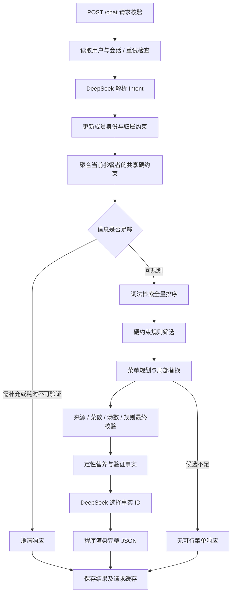

# 系统架构

本文件描述当前代码实现。项目采用 FastAPI 模块化单体：DeepSeek 负责结构化意图提取和解释事实选择，程序负责数据、约束记忆、检索、规则、规划及最终校验。

## 一次请求的数据流

解释当前菜单时直接重新验证已有记录，不必重新检索。兼容字段保留 1 人、晚餐、3 道菜、0 道汤的初始值，但人数与餐次必须在 confirmed_fields 中明确确认后才允许规划；已有档案过敏可作为已知忌口。缺少人数、餐次或忌口时返回结构化问题，不执行检索与规划。总菜数包含汤。

## 模块职责

| 模块 | 当前实现 |
| --- | --- |
| `app/api/main.py` | `GET /health`、`GET /demo/profiles`、`POST /chat`；限制输入，统一错误码；进程内容量上限 8 |
| `app/domain/models.py` | Pydantic 领域对象和响应协议，拒绝未声明字段 |
| `app/agent/service.py` | 读取档案、解析意图、合并约束、处理澄清、编排规划、输出校验 |
| `app/agent/diners.py` | 稳定成员身份、别名消歧、出席状态、共享硬约束聚合与逐人核验 |
| `app/tools/` | 注册并调用 `recipe_search`、`health_check`、`menu_modify`、`nutrition_analysis`，记录计数与状态；旧 registry 导入保留兼容 |
| `app/agent/planner.py` | 确定性选菜、汤数与去重、指定替换、整体拒绝、保留仍可行的原位置菜品 |
| `app/retrieval/keyword.py` | 菜名、食材别名、标签和餐次匹配；可选全部精确标签筛选；无显式筛选时保留完整候选集 |
| `app/rules/engine.py` | 配料及步骤约束筛查、库存核对、有限健康偏好排序 |
| `app/nutrition/` | 食材来源、单菜/整餐组成、目标匹配、风险，不生成精确营养值 |
| `app/infrastructure/data.py` / `synthetic.py` | 本地真实数据验收与HTTP合成目录分离；GB18030 菜谱导入、JSON 档案导入、稳定 ID、质量报告 |
| `app/infrastructure/sessions.py` | SQLite 会话快照、版本检查和已完成请求缓存 |
| `app/infrastructure/llm/` | `BaseLLM` 边界与 DeepSeek HTTP 适配；业务层不直接依赖模型 API |
| `pipelines/normalize.py` | 重建规范化数据、词法索引及数据质量报告 |

注册工具只接受业务参数，由上述固定流程调用。当前没有让模型自由选择 shell、SQL、任意 URL 或运行任意代码的功能。检索服务使用单独 `search(query_terms, constraints, limit, *, required_labels=None)` 边界，后续可更换候选召回实现；当前没有向量数据库，也没有已经实现的向量 RAG。`required_labels` 是检索模块接口的显式筛选参数，要求全部精确匹配，没有匹配就返回空候选；当前自然语言 Intent 未暴露任意硬标签约束。标签不构成健康资格判断。

## 数据与事实边界

原始 `dataset/` 文件纳入本地 Git 并保持不变；可重建 `artifacts/` 不纳入 Git。2000 条菜谱全部保存，基于内容摘要生成稳定 ID，同名不同配方分开。缺步骤、加工程序和占位数据保留质量记录并限制进入规划。数据层详见 [DATA.md](DATA.md)。

菜谱没有可靠份数、成分营养表或整餐总耗时。未知用量与空体检指标不补零；类别和烹饪方式属于启发式元数据。营养或健康适配不能由原始 `label` 中“减脂”等标签直接得出。

规则定义在 `configs/rules.yaml`：过敏原、食材别名、复合配料不确定项和不辣规则属于筛查依据；控糖、增肌、减脂、降尿酸和降压属于定性排序偏好，不能绕过硬约束，也不构成临床建议或治疗结论。未知过敏原要求澄清；未配置的健康目标返回说明。严格库存核对食材种类及调料，但不保证库存数量足够。

Planner 排除标记为甜品、饮料或加工组件的候选，优先保留仍符合新约束的旧菜，并在空位上考虑类别与做法多样性。对于尚未覆盖的食材偏好，再尝试严格增加菜单级覆盖的局部交换，保留已经覆盖的偏好、汤数和指定替换范围；优先复用已经调整的槽位，未覆盖项给出提示。它是确定性的启发式组合器，不保证全局最少修改或最优营养。仅健康排序分变化不触发既有菜单重排。

多人状态分为两层：`meal_constraints` 保存未归属个人的整桌要求，`diners` 保存稳定成员、别名、出席状态及归属事实。当前参餐者的过敏、排除食材和不辣要求由确定性程序取并集形成规划用 `constraints`；任何一人的硬约束都作用于整桌共享菜。成员退出仅停止其本餐约束贡献，不删除个人事实。最终菜单除整桌规则校验外，还逐人生成 `diner_suitability`；该结果只基于已知事实，不把未提供信息声明为安全或营养达标。人数大于实名成员数时允许继续规划，但明确提示剩余成员信息未知；实名参餐者多于已确认总人数时必须澄清。

规则配置中的 `food_families` 表达猪肉、鸡肉、牛肉与部位及加工来源的方向性归属，独立于库存用的 `aliases`。鸡腿菇等同形词被排除；相关肉类限制下，来源不明的复合配料保守拦截并说明不确定性，不能作为已满足食材偏好的证据。小麦词表覆盖吐司、法棍等常见派生食材；仍属于有限审核词典。

## 模型边界与失败行为

DeepSeek 通过 JSON 模式提取 `Intent`，响应须通过 JSON 格式、重复键、完整性、Pydantic 及语义校验。模型不能直接替换完整会话或自行撤销既有不辣要求。意图请求会向 DeepSeek 发送用户消息、当前会话约束、当前菜单 ID 与槽位、菜单有效标志、待澄清信息、最近 6 条历史消息、已确认字段 `confirmed_fields`，以及档案中的 `preferences`、`allergies`、`health_goals`、`special_groups`。这些字段包括偏好、过敏、健康需求和特殊人群信息，不能描述为“健康信息完全不外传”。不会向模型发送档案 `raw`、体检指标、BMI、身高、体重等完整原始档案字段。用户已确认真实 DeepSeek 联调仅使用合成资料，原始健康档案和原始对话仅用于本地离线验证，不执行原始档案外部回放；本地离线回放和自造档案真实模型联调分别覆盖业务流程与模型接入，不代替原始档案外部回放。

解释阶段输入程序构造的事实字典，模型只能选择并排序已存在事实 ID。程序最终渲染事实文本，并补上菜谱来源、约束及定性营养边界，模型不自由编写菜名、配料、营养数值或健康效果。解释调用失败时回退到同一份已验证事实；意图解析失败则返回 502 或 503，不伪装成成功规划。

接口输出完整 JSON；当前没有 SSE 或首 Token 流式承诺。`timings_ms` 记录本轮解析、检索规则规划、解释及总耗时，排队时间不计入这些内部计时。

## 会话与请求一致性

SQLite 默认位于 `runtime/sessions.sqlite3`。会话包括用户、版本号、累计约束、当前菜单 ID、有效标志、未解决澄清和最近 12 条对话。新增 `rejected_recipe_ids` 记录本餐明确整份否定的菜品，规划前持久化；后续规划、建议和解释均排除这些菜及同名变体。普通局部替换不累加拒绝记忆，新会话独立。旧会话与请求缓存缺少该字段时按空列表加载，无需SQL表迁移。每个会话通过进程内异步锁串行处理；数据库采用短事务与版本条件检查，模型调用期间不持有数据库事务。

第一次带 `request_id` 的请求通过 UUID5（`fangtai:{user_id}:{request_id}`）派生会话 ID，确保首轮响应丢失后仍可定位同一个会话。不带 `request_id` 时随机生成会话。后续请求必须传回已存在的 `session_id`，其他用户使用此会话返回 409。

同一会话内，完成结果以 `request_id`、请求内容哈希和结果版本保存。相同请求且会话版本仍未前进时复用已完成响应；相同 ID 换消息或重试过期结果返回 409。完整语义见 [API.md](API.md)。

约束更新先于规划结果持久化，因此已接收的限制不会因规划失败被遗忘，旧菜单先标记无效。当前未实现进行中请求的崩溃恢复日志：若进程在保存约束与保存结果之间退出，不能提供完整 exactly-once 保证。会话锁属于单进程，部署必须使用 1 个 worker；多进程协调、锁清理和容量管理仍需后续完善。

## 验证路径

- `python -m evaluation.offline`：用人工标注的结构化 Intent 驱动原始 20 个场景的本地业务流程，以配置中明确的测试餐次上下文验证约束与规划，不评价真实模型 NLU；`--unprepared` 不预置上下文。真实数据验收使用不预置模式。
- `python -m evaluation.smoke_synthetic`：用自造用户 900001 与自造对话，通过真实 DeepSeek 和 ASGI 接口联调，不向模型发送原始健康档案。
- `python -m evaluation.replay --base-url http://localhost:8080`：使用 HTTP 服务和原始场景的真实回放，会发送上文列明字段，按用户已确认的仅使用合成资料范围，不执行该入口。

实际运行结果由开发日志记录。离线通过、自造场景联调通过和原始数据外部回放完成是不同证据，不能相互替代。

## 部署范围与后续扩展

当前为无鉴权本地 Demo，HTTP 服务绑定 `127.0.0.1`。`/health` 检查应用数据状态，不发送模型请求，也不能验证 API Key 有效性。配置由 `Settings` 从本地 `.env` 或环境变量加载，密钥使用 `SecretStr` 存储。仓库有 Dockerfile，但实际构建与运行结果须单独记录，不能由 Python 测试推断。

下一阶段可在既有边界上扩充审核词典与定量营养来源、独立评测断言，以及经过身份核对的个人安全限制撤销操作；再按实测错误引入新的检索实现，按耗时结果优化模型与缓存。多 worker、鉴权、请求恢复和部署监控属于服务化所需工作。

## 主动澄清与迁移

`confirmed_fields` 记录本餐已确认的人数、餐次、忌口；`pending_fields` 绑定上一轮具体问题，避免把时间问题的“没有”当作无忌口。简短或模糊回答不会自动补齐默认值，明确无其他忌口也不会清空档案过敏。旧 SQLite 会话缺少新字段时重新询问未知信息，不信任旧默认值。

成功流程经四个业务工具完成；解释当前菜单仅调用核查与营养工具，不调用 `menu_modify`。澄清响应包含 `clarification_questions`，前端可按字段和建议选项展示。

## 比赛 Demo 输出与资料边界

HTTP 启动默认使用 load_synthetic_catalog，只读取菜谱 CSV，加载 900001—900003 三个手写合成画像；真实档案加载器只供本地验收。UserProfile.data_scope 默认 original，只有手写合成画像显式声明 synthetic；DeepSeek.parse 在任何网络请求前阻断 original。客户端不能经 /chat 覆盖这一标记。

响应 schema_version=2.0，保留旧字段，新增菜品卡片、结构化原始配料与步骤、CSV来源指纹，以及单菜/整餐定性营养对象。未知图片、总耗时和份量不填猜测值。card badges 使用白名单，来源和营养不从健康宣传标签推断。

待澄清过敏词只能通过 `allergy_clarifications` 的逐项映射解除；映射键必须存在于 pending_allergy_terms，普通追加过敏不清空旧待答项。解除待答项也不能撤销任何已知过敏原。

## v0.3.0 前端与部署

新增独立Vue3前端frontend/，后端app/保持原结构与schema_version=2.0。Docker Compose由Nginx在localhost:8080提供/和/demo，/api同源代理至内部单worker FastAPI；原/docs及验收接口保留。会话沿用原命名卷，前端内存保存当前对话。完整方案见[前端架构](FRONTEND_ARCHITECTURE.md)，交付见[v0.3.0报告](DEMO_V030_REPORT.md)。
